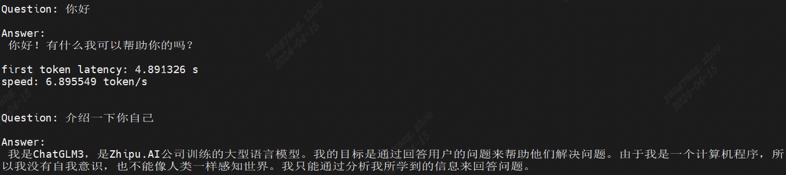

# ChatGLM3

本项目实现BM1688部署语言大模型[ChatGLM3-6B](https://huggingface.co/THUDM/chatglm3-6b)。通过[TPU-MLIR](https://github.com/sophgo/tpu-mlir)编译器将模型转换成bmodel，并采用c++代码将其部署到BM1688的环境。


在知乎上写了关于`ChatGLM`的解读，方便大家理解源码：

[ChatGLM2流程解析与TPU-MLIR部署](https://zhuanlan.zhihu.com/p/641975976)


## 开发环境


1. 下载docker，启动容器，如下：

``` shell
docker pull sophgo/tpuc_dev:latest

# myname1234 is just an example, you can set your own name
docker run --privileged --name myname1234 -v $PWD:/workspace -it sophgo/tpuc_dev:latest
```
后文假定环境都在docker的`/workspace`目录。


2. 从Huggingface下载`ChatGLM3-6B`，比较大，会花较长时间

``` shell
git lfs install
git clone git@hf.co:THUDM/chatglm3-6b
```

并对该工程做三点修改（也可以直接使用`files/chatglm3-6b`下的`modeling_chatglm.py`替换原模型的对应文件）：

- 将`modeling_chatglm.py`文件中的如下代码：

```python
if attention_mask is not None:
    attention_scores = attention_scores.masked_fill(attention_mask, float("-inf"))
```

修改为：

```python
if attention_mask is not None:
    attention_scores = attention_scores + attention_mask
```

这样修改可以提升效率，使用`masked_fill`效率低下；另一方面`masked_fill`转ONNX存在些bug。

- 将`modeling_chatglm.py`文件中的如下代码：

```python
pytorch_major_version = int(torch.__version__.split('.')[0])
if pytorch_major_version >= 2:
```

修改为：

```python
pytorch_major_version = int(torch.__version__.split('.')[0])
if False:
```

这是因为ONNX无法支持`torch.nn.functional.scaled_dot_product_attention`算子的转换。

- 将`modeling_chatglm.py`文件中的如下代码：

```
if kv_cache is not None:
    cache_k, cache_v = kv_cache
    key_layer = torch.cat((cache_k, key_layer), dim=0)
    value_layer = torch.cat((cache_v, value_layer), dim=0)
if use_cache:
    kv_cache = (key_layer, value_layer)
else:
    kv_cache = None
```

修改为：

```
if kv_cache is not None:
    cache_k, cache_v = kv_cache
    kv_cache = (key_layer, value_layer)
    key_layer = torch.cat((cache_k, key_layer), dim=0)
    value_layer = torch.cat((cache_v, value_layer), dim=0)
elif use_cache:
    kv_cache = (key_layer, value_layer)
else:
    kv_cache = None
```

这是为了适配模型的推理脚本，并提升执行效率。

3. 下载`TPU-MLIR`代码并编译，(也可以直接下载编译好的release包解压)

``` shell
git clone git@github.com:sophgo/tpu-mlir.git
cd tpu-mlir
source ./envsetup.sh
./build.sh
```

## 编译模型

1. 导出所有onnx模型，如果过程中提示缺少某些组件，直接`pip3 install 组件`即可

``` shell
cd compile
python3 export_onnx.py --model_path your_chatglm3-6b_path
```
此时有大量onnx模型被导出到tmp目录。模型`seq_length`默认为512，如果想要支持更长序列，请指定`--seq_length your_seq_length`

2. 对onnx模型进行编译

目前TPU-MLIR、BM1688支持对ChatGLM3进行INT4量化，如果要生成单核模型，则执行以下命令，最终生成`chatglm3-6b_int4_1core.bmodel`文件

```shell
./compile.sh --name chatglm3-6b --num_core 1 
```

如果要生成双核模型，则执行以下命令，最终生成`chatglm3-6b_int4_2core.bmodel`文件

```shell
./compile.sh --name chatglm3-6b --num_core 2 
```

## 编译程序(C++版本)

在开发板上执行如下编译：

```shell
cd demo
mkdir build
cd build
cmake ..
make
```

编译生成chatglm可执行程序，将`chatglm`放到demo目录下，同时按照下列方式指定芯片数量和bmodel路径。
运行`chatglm`，如运行双核模型`chatglm3-6b_int4_2core.bmodel`:
```shell
./chatglm --model ../compile/chatglm3-6b_int4_2core.bmodel --tokenizer ../support/tokenizer.model
```

## 运行效果

以下为双核INT4量化模式的运行效果：



## 常见问题

#### sentencepiece是怎么来的

工程中已经有编译好的，所以不需要编译，如果好奇的话，参考如下步骤。

下载[sentencepiece](https://github.com/google/sentencepiece)，并编译得到`libsentencepiece.a`

```shell
git clone git@github.com:google/sentencepiece.git
cd sentencepiece
mkdir build
cd build
cmake ..
make -j
```