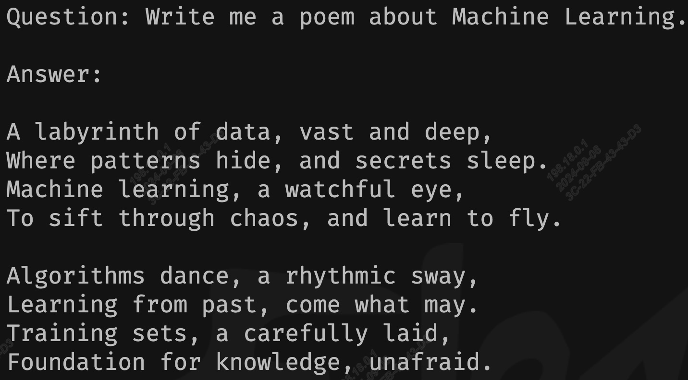

# MiniCPM

本项目实现BM1688部署语言大模型[Gemma-2B](https://huggingface.co/google/gemma-1.1-2b-it)。通过[TPU-MLIR](https://github.com/sophgo/tpu-mlir)编译器将模型转换成bmodel，并采用c++代码将其部署到BM1688的环境。


## 开发环境


1. 下载docker，启动容器，如下：

``` shell
docker pull sophgo/tpuc_dev:latest

# myname1234 is just an example, you can set your own name
docker run --privileged --name myname1234 -v $PWD:/workspace -it sophgo/tpuc_dev:latest
```
后文假定环境都在docker的`/workspace`目录。


2. 从Huggingface下载`Gemma-2B`，比较大，会花较长时间。

``` shell
git lfs install
git clone git@hf.co:google/gemma-1.1-2b-it
```

因为其依赖较新的torch，需要更新torch如下：
``` shell
pip install --upgrade torch torchvision torchaudio
```

另外需要做一些模型源码上的修改：
* 将`compile/files/gemma-2b-it`下的`config.json`替换`gemma-2b-it`中的`config.json`
* 将`compile/files/gemma-2b-it`下的`modeling_gemma.py`替换`transformers/models/gemma/modeling_gemma.py`，类似如下:

``` shell
# 请根据实际transformers目录调整
cp files/gemma-2b-it/modeling_gemma.py  /root/miniconda3/lib/python3.10/site-packages/transformers/models/gemma/
```


3. 下载`TPU-MLIR`代码并编译，(也可以直接下载编译好的release包解压)

``` shell
git clone git@github.com:sophgo/tpu-mlir.git
cd tpu-mlir
source ./envsetup.sh
./build.sh
```

## 编译模型

1. 导出所有onnx模型，如果过程中提示缺少某些组件，直接`pip3 install 组件`即可

``` shell
cd compile
python3 export_onnx.py --model_path your_gemma-2b_path
```
此时有大量onnx模型被导出到tmp目录。

2. 对onnx模型进行编译

目前TPU-MLIR、BM1688支持对Gemma进行INT4量化，如果要生成单核模型，则执行以下命令，最终生成`gemma-2b_int4_1core.bmodel`文件

```shell
./compile.sh --name gemma-2b --num_core 1
```

如果要生成双核模型，则执行以下命令，最终生成`gemma-2b_int4_2core.bmodel`文件

```shell
./compile.sh --name gemma-2b --num_core 2
```

## 编译程序(C++版本)

在开发板上执行如下编译：

```shell
cd demo
mkdir build
cd build
cmake ..
make
```

编译生成gemma可执行程序，将`gemma`放到demo目录下，同时按照下列方式指定bmodel路径。
运行`gemma`，如运行双核模型`gemma-2b_int4_2core.bmodel`:
```shell
./gemma --model ../compile/gemma-2b_int4_2core.bmodel --tokenizer ../support/tokenizer.model
```

## 运行效果

以下为双核INT4量化模式的运行效果：



## 常见问题

#### sentencepiece是怎么来的

工程中已经有编译好的，所以不需要编译，如果好奇的话，参考如下步骤。

下载[sentencepiece](https://github.com/google/sentencepiece)，并编译得到`libsentencepiece.a`

```shell
git clone git@github.com:google/sentencepiece.git
cd sentencepiece
mkdir build
cd build
cmake ..
make -j
```