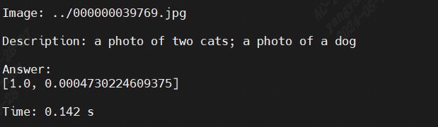

# OpenClip

本项目实现BM1688部署[OpenClip](https://huggingface.co/openai/clip-vit-base-patch32)。通过[TPU-MLIR](https://github.com/sophgo/tpu-mlir)编译器将模型转换成bmodel，并采用python与c++代码将其部署到BM1688的环境。


## 开发环境


1. 下载docker，启动容器，如下：

``` shell
docker pull sophgo/tpuc_dev:latest

# myname1234 is just an example, you can set your own name
docker run --privileged --name myname1234 -v $PWD:/workspace -it sophgo/tpuc_dev:latest
```
后文假定环境都在docker的`/workspace`目录。


2. 从Huggingface下载`OpenClip`

``` shell
git lfs install
git clone git clone git@hf.co:openai/clip-vit-base-patch32
```


3. 下载`TPU-MLIR`代码并编译，(也可以直接下载编译好的release包解压)

``` shell
git clone git@github.com:sophgo/tpu-mlir.git
cd tpu-mlir
source ./envsetup.sh
./build.sh
```

## 编译模型

1. 导出所有onnx模型，如果过程中提示缺少某些组件，直接`pip3 install 组件`即可，注意`transformers`版本要`>=4.41.0`

``` shell
cd compile
python3 export_onnx.py --model_path your_OpenClip_path
```
此时模型被导出到tmp目录。

2. 对onnx模型进行编译

目前TPU-MLIR、BM1688支持对OpenClip进行INT4量化，如果要生成单核模型，则执行以下命令，最终生成`OpenClip_int4_1core.bmodel`文件

```shell
./compile.sh --mode int4 --num_core 1 
```

如果要生成双核模型，则执行以下命令，最终生成`OpenClip_int4_2core.bmodel`文件

```shell
./compile.sh --mode int4 --num_core 2 
```

## 编译程序

在开发板上执行如下编译：

```shell
pip3 install -r requirements.txt
cd demo
mkdir build
cd build
cmake .. -DCMAKE_PREFIX_PATH=~/.local/lib/python3.8/site-packages/pybind11
make
```

编译生成demo可执行程序，将`demo.cpython-38-aarch64-linux-gnu.so`放到demo目录下，同时按照下列方式指定bmodel路径。
如运行双核模型`OpenClip_int4_2core.bmodel`:
```shell
python3 demo.py --model_path ../compile/OpenClip_int4_1core.bmodel --config_path ../config/
```

## 运行效果

以下为双核INT4量化模式的运行效果：


